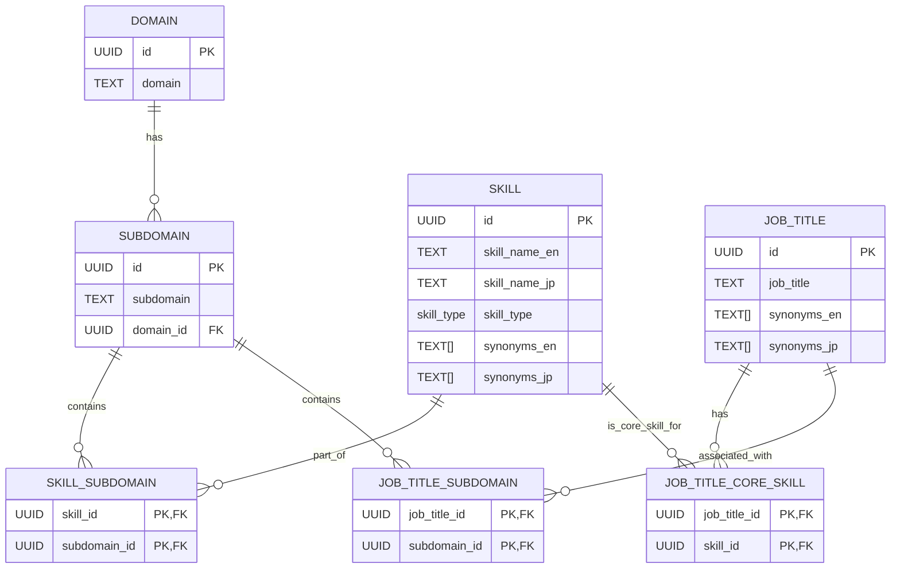

# CRUD API Server Plan

This document outlines the plan for creating a CRUD API server using Python with FastAPI and SQLAlchemy for the provided PostgreSQL database schema.

### **1. Project Setup**

*   **Create Project Directory**: Initialize a new directory for the API server (e.g., `crud_api_server`).
*   **Virtual Environment**: Set up a Python virtual environment to manage dependencies.
*   **Install Dependencies**: Install `fastapi`, `uvicorn` (ASGI server), `sqlalchemy` (ORM), `psycopg2-binary` (PostgreSQL adapter), and `pydantic` (data validation).

### **2. Database Model Definition (SQLAlchemy ORM)**

*   **`app/database.py`**:
    *   Configure the SQLAlchemy engine and session factory.
    *   Define a `Base` class for declarative models.
    *   Implement a dependency to get a database session for each request.
*   **`app/models.py`**:
    *   Translate each table from the SQL schema into a SQLAlchemy ORM model class.
    *   Define columns with appropriate SQLAlchemy types (e.g., `UUID`, `String`, `Enum`, `ARRAY`).
    *   Map `skill_type` to a Python `Enum` and register it with SQLAlchemy.
    *   Establish relationships between models (e.g., `Domain` to `Subdomain`, `Skill` to `SkillSubdomain`) using `relationship()` for easy querying.

### **3. API Schema Definition (Pydantic)**

*   **`app/schemas.py`**:
    *   Create Pydantic models for data validation and serialization.
    *   **Base Schemas**: Define `Create`, `Update`, and `Response` schemas for each entity (`Domain`, `Subdomain`, `Skill`, `JobTitle`).
    *   **Relationship Schemas**: Include nested Pydantic models in `Response` schemas to represent related data (e.g., a `SubdomainResponse` might include its `DomainResponse`).
    *   **Join Table Schemas**: Define schemas for the join tables if direct manipulation is needed, or integrate their logic into the main entity schemas.

### **4. CRUD Endpoints Implementation**

*   **`app/routers/`**: Create separate router files for each main entity (`domains.py`, `subdomains.py`, `skills.py`, `job_titles.py`).
*   **Standard CRUD**: For each entity, implement the following endpoints:
    *   `POST /api/{entity}`: Create a new record.
    *   `GET /api/{entity}/{id}`: Retrieve a single record by ID.
    *   `PUT /api/{entity}/{id}`: Update an existing record by ID.
    *   `DELETE /api/{entity}/{id}`: Delete a record by ID.

### **5. Advanced Listing APIs for LLM Tool Calling**

This is a critical part to provide flexible data combinations. The `GET /api/{entity}` endpoints will be enhanced with query parameters to allow filtering and joining across related tables.

*   **`GET /api/domains`**:
    *   `?subdomain_name={name}`: List domains that contain a subdomain with a specific name.
*   **`GET /api/subdomains`**:
    *   `?domain_id={uuid}`: List subdomains belonging to a specific domain.
    *   `?domain_name={name}`: List subdomains belonging to a domain with a specific name.
    *   `?skill_name_en={name}`: List subdomains associated with a skill (via `skill_subdomain` join table).
*   **`GET /api/skills`**:
    *   `?skill_type={soft|technical|other}`: Filter skills by type.
    *   `?subdomain_id={uuid}`: List skills associated with a specific subdomain.
    *   `?subdomain_name={name}`: List skills associated with a subdomain by name.
    *   `?domain_id={uuid}`: List skills associated with a specific domain (via subdomain).
    *   `?domain_name={name}`: List skills associated with a domain by name.
    *   `?synonym_en={synonym}`: Search skills by English synonym (using array contains operator).
    *   `?job_title_id={uuid}`: List skills that are core skills for a specific job title.
    *   `?job_title_name={name}`: List skills that are core skills for a job title by name.
*   **`GET /api/job_titles`**:
    *   `?skill_id={uuid}`: List job titles that have a specific core skill.
    *   `?skill_name_en={name}`: List job titles that have a core skill by English name.
    *   `?skill_type={soft|technical|other}`: List job titles that have core skills of a specific type.
    *   `?subdomain_id={uuid}`: List job titles associated with a specific subdomain.
    *   `?subdomain_name={name}`: List job titles associated with a subdomain by name.
    *   `?domain_id={uuid}`: List job titles associated with a specific domain (via subdomain).
    *   `?domain_name={name}`: List job titles associated with a domain by name.
    *   `?synonym_en={synonym}`: Search job titles by English synonym (using array contains operator).

### **6. Error Handling**

*   Implement FastAPI's `HTTPException` for common errors (e.g., 404 Not Found, 400 Bad Request, 409 Conflict for duplicates).

### **7. Main Application Entry Point**

*   **`app/main.py`**:
    *   Create the FastAPI application instance.
    *   Include all defined routers.
    *   Add event handlers for database connection/disconnection.

### **Mermaid Diagrams**

#### **Database Schema (ERD-like)**



#### **API Endpoints Overview**

```mermaid
graph TD
    A[Client] --> B{FastAPI Application}

    subgraph API Endpoints
        B --> D1[/domains]
        B --> D2[/subdomains]
        B --> D3[/skills]
        B --> D4[/job_titles]
    end

    subgraph Domain Endpoints
        D1 -- GET --> D1_1[List Domains (with filters)]
        D1 -- GET /{id} --> D1_2[Get Domain by ID]
        D1 -- POST --> D1_3[Create Domain]
        D1 -- PUT /{id} --> D1_4[Update Domain]
        D1 -- DELETE /{id} --> D1_5[Delete Domain]
    end

    subgraph Subdomain Endpoints
        D2 -- GET --> D2_1[List Subdomains (with filters)]
        D2 -- GET /{id} --> D2_2[Get Subdomain by ID]
        D2 -- POST --> D2_3[Create Subdomain]
        D2 -- PUT /{id} --> D2_4[Update Subdomain]
        D2 -- DELETE /{id} --> D2_5[Delete Subdomain]
    end

    subgraph Skill Endpoints
        D3 -- GET --> D3_1[List Skills (with filters)]
        D3 -- GET /{id} --> D3_2[Get Skill by ID]
        D3 -- POST --> D3_3[Create Skill]
        D3 -- PUT /{id} --> D3_4[Update Skill]
        D3 -- DELETE /{id} --> D3_5[Delete Skill]
    end

    subgraph Job Title Endpoints
        D4 -- GET --> D4_1[List Job Titles (with filters)]
        D4 -- GET /{id} --> D4_2[Get Job Title by ID]
        D4 -- POST --> D4_3[Create Job Title]
        D4 -- PUT /{id} --> D4_4[Update Job Title]
        D4 -- DELETE /{id} --> D4_5[Delete Job Title]
    end

    style D1_1 fill:#f9f,stroke:#333,stroke-width:2px
    style D2_1 fill:#f9f,stroke:#333,stroke-width:2px
    style D3_1 fill:#f9f,stroke:#333,stroke-width:2px
    style D4_1 fill:#f9f,stroke:#333,stroke-width:2px